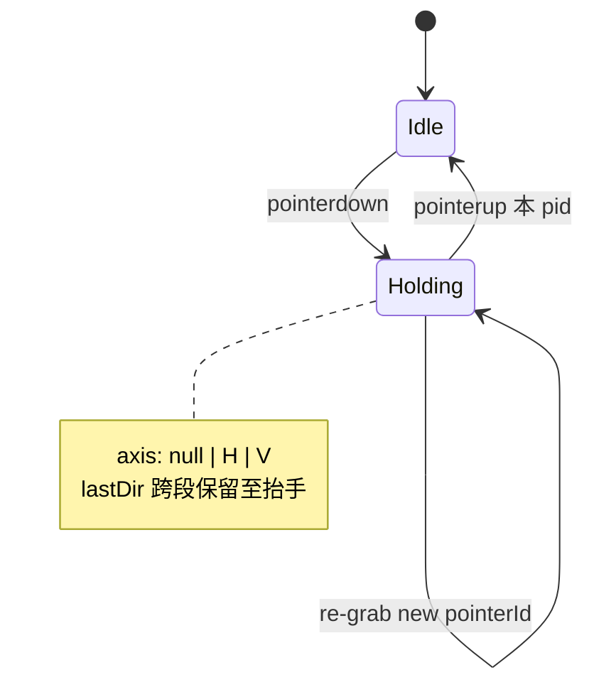
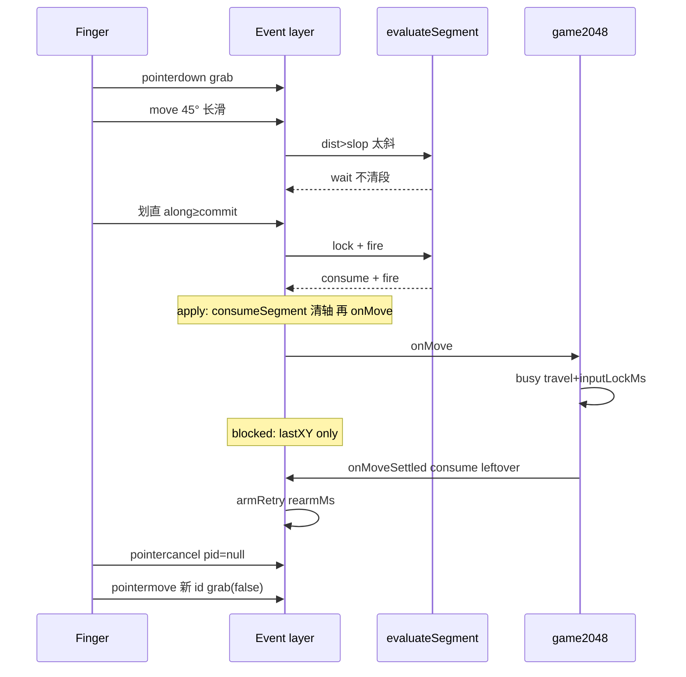

# Swipe_2048 四向手势状态机设计

| 字段 | 值 |
|------|----|
| 日期 | 2026-09-01 |
| 状态 | 判定层已落地；产品默认与 UI 以 `IMPLEMENTATION.md` 为准 |
| 本文范围 | `evaluateSegment`、抬手 K13、blocked 冻结、事件层接线 |
| 实现 | `swipeSegment.ts` · `swipeVelocity.ts` · `swipeInput.ts` |

### 现行产品（本文未逐条展开处）

完整默认值、模式绑定、UI：`docs/IMPLEMENTATION.md`。检索：`docs/SWIPE-RESEARCH-2026-09.md`。

- **手感1**：本文判定 + 沿轴 `commit` 出手。单块模式默认。  
- **手感2**：同一套认方向；出手再加 **轴上 80ms 窗速度 ≥ speedPxS**；`lastDir !== null` 则本按下不再 fire。2048 模式默认。速度 **不判向**。本按下若已出现 **along≥commit 且速度不够**，锁 `slowDrag`，之后再快滑/快抬手也不 fire。**抬手不把 pointerup 写入速度窗**，且抬手判定忽略末 **32ms**。  
- 旋钮含 `scheme`、`speedPxS`、`slideMs`、`slideEase`、`boardY`、`boardScale` 等。默认以 `IMPLEMENTATION.md` 为准（现行：`slideMs` 65，`boardY` 0，`boardScale` 1.1，`inputLockMs` 0）。  
- 轨迹不做线性插值来认方向（弦 = 段位移）。  
- 黄块切模式；设置打开手感表。

---

## Overview

判定层纯函数 + 薄事件层。状态 `Idle | Holding`（轴 `null | H | V`），`isBlocked` 外置。斜向等待、出手清段、cancel 不断按住。不改 Capacitor 底座。

---

## Background & Motivation

### 当前状态

- 玩法：`merge`（标准 2048）+ `solo`（一颗块滑到墙，时长 = 格数 × `tileMoveMs`）。
- 输入：全屏 `window` Pointer Events → 离散 `Dir`（0 上 / 1 右 / 2 下 / 3 左）。
- 手感：`localStorage` `swipe2048.feel.byMode`，面板 `#feel-panel`。默认见 `IMPLEMENTATION.md`。
- 底座：390×844 设计 px，UI 只挂 `#ui-root`，`vite base: './'`，无 WebGPU 不回退。

### 痛点（重构必须修）

1. **`commitIfReady` 揉在一起**：未锁轴、已锁 relock、出手、同向吞掉。
2. **斜向等待非正式**：`dirFromDelta` 返回 null 时 `return`，注释写「不清段」——规范必须写成规则。
3. **`endHold` 抬手规则要原样写出**（不是「改进」）：仅 `lastDir===null && slop≤dist<commit` → `onInvalid`；否则走与 move 相同的 `commitIfReady`（含 relock）。长斜 45° 且 `dist≥commit` 抬手 **不 nudge**。
4. **两道时间门**：`inputLockMs` 与 `rearmMs` 分职责，不得删。
5. **面板文案**：每个旋钮语义以本文 + `feel.ts` `FEEL_FIELDS.why` 为准。

### 踩过的坑（约束，不是历史闲话）

| 现象 | 根因 | 规范对策 |
|------|------|----------|
| 斜下当左 | 整按下净向量 / 过早锁轴 | 段内锁轴；commit 只看 along |
| 长按斜向反轴 | settle 才清原点，尾巴并进下一段 | **出手瞬间** `consumeSegment` |
| cancel 后失灵到抬手 | cancel 清 pid 且当结束按住 | holding 保持；新 pointer 再 grab |
| 阈值桌面/真机不一致 | 用 raw 设计 px 比 client | `designPx × (stageWidth/390)` |
| busy 期间斜尾抢轴 | blocked 时仍 lock/relock | blocked **整段冻结判定** |

---

## Goals & Non-Goals

### Goals

- 手势规范单一源：状态、转换、斜向、consume、抬手 invalid。
- 判定层纯函数，可单测 45° 长滑不 consume、看清后 along≥commit 出手、relock、同向吞掉、现 `endHold` 抬手。
- 事件层只负责 pointer / capture / cancel / 缩放 / `isBlocked` 闸门。
- 9 旋钮全部保留接线；默认值钉死。
- 增量 PR：纯判定（合同=现行为）→ 接线 pointer（行为字节级对齐）→ 文档。

### Non-Goals

- 新玩法、改合并规则、改 solo 恒速公式。
- 改 DOM（`#shell > #viewport > #app > #stage`）。
- Capacitor / Native Haptics / Android / WebGL 回退。
- `UISwipeGestureRecognizer`、速度阈值、`getCoalescedEvents` 判向、整按下 directionalLock、独立 `lockPx`。
- 删除 `inputLockMs` 或 `rearmMs`。
- **不改变抬手 nudge 集合**（长斜 `dist≥commit` 抬手仍静默）。若产品以后要「太斜抬手必抖」，另开变更，带测试，不塞进本次重构。

---

## Key Decisions

下列合同已钉死，重构不得推翻。

| ID | 决策 |
|----|------|
| K1 | Pan → 离散四向。禁止系统 Swipe。滑距 ≠ 棋子停点。 |
| K2 | **增量段**：出手瞬间 `consumeSegment`（类比 `setTranslation(0)`）。禁止等动画 settle 才当唯一清原点。`onMoveSettled` 只吸收 **本段已 fire** 的 leftover + `armRetry(rearmMs)`。busy 里新按下的段（`lastDir===null`）或已抬手排队的段 **不清原点**，settle 后立刻判定。 |
| K3 | **段内锁轴（WWDC hysteresis）**：位移 ≥ slop 且主轴 ≥ 副轴 × `axisRatio` 才锁。出手后尾部 **不能改轴**（consume 已清轴）。出手前副轴 ≥ slop 且副轴 ≥ 主轴 × `axisRatio` 可 **relock**（**move 与 up 共用**，因 up 走同一套判定）。 |
| K4 | **斜向等待**：未看清时 **不清段、不 snap、不在 commit 距离作废重来**。继续累计同一段，等划直。 **例外（仅 2048）**：未锁轴且偏角 ≥ 40°、两轴都 ≥ commit 时，用只读 `legal(dir)` 分叉——唯一能走的一向才 fire；两向都能走仍等待；两向都不能走则 `dead`（较长轴，事件层 `onInvalid`）。已锁轴永不改判。涂色不传 `legal`。 |
| K5 | **holding ≠ pointerId**。`pointercancel`：pid=null，holding 仍 true。随后 **`pointermove` 用新 id `grab(false)`**（同一指续滑）。**`pointerdown` 一律 `grab(true)` 开新段**（iOS 常把抬手当 cancel，否则手感2 会丢掉下一甩）。非当前 pid 的 `pointerup` **忽略**（不 Idle）。 |
| K6 | 全屏 `window` pointer；`touch-action: none`；holding 时 non-passive **`touchstart` + `touchmove`** `preventDefault`。忽略 `#feel-panel` / `#device-switcher` / `button,a,input`。 |
| K7 | 不用 coalesced 判向；不用整按下 lock；不用速度；不加 `lockPx`（slop 兼开始认滑）。 |
| K8 | 模式 `merge` / `solo`。solo 时长 = `maxTravelCells × tileMoveMs`。 |
| K9 | 手感 9 键 + `swipe2048.feel`。默认：slop 10、commit 16、axisRatio 1.55、tileMoveMs 60、inputLockMs 10、rearmMs 10、nudgePx 1、nudgeMs 50、sameDirRepeat false。**建议** commit > slop；clamp **不**自动纠正。若 `commit≤slop`：锁轴那一帧 along 往往已 ≥commit，**可立即 fire**。 |
| K10 | 阈值单位：设计 px。运行时 `client = designPx * (target.getBoundingClientRect().width / DESIGN_WIDTH)`。`DESIGN_WIDTH=390`。 |
| K11 | `isBlocked` 外置（**仅** `merge && state.over`；动画不挡输入）。**`state.won && !state.over` 不 blocked**。Blocked **不是** 状态机状态。blocked 时：禁止判定；只更新 `lastX/Y`。游戏层不再因滑移结束调用 `onMoveSettled`。出手瞬间已 `consumeSegment`。`blocked` **不进入** `SegmentInput`。 |
| K12 | 键盘（方向键 / WASD）旁路判定层，直接 `onMove`；仍尊重 `isBlocked`；`e.repeat` 忽略。 |
| K13 | **抬手 invalid 谓词（现 `endHold`，钉死）**：非 cancel、非 blocked 时：若 `lastDir===null && slop≤dist<commit`（`dist=max(|dx|,|dy|)`）→ `onInvalid`，**不**再跑判定。否则与 move 一样调用判定（可 lock/relock/fire/同向 consume）。因此 **45° 长滑 `dist≥commit` 抬手：不 invalid、判定 no-op、不 nudge**。 |
| K14 | **进后台撤回最近指针走棋**：系统上滑常先 `pointerup` 再 hidden。抬手后 **800ms** 内 hidden/pagehide/blur/freeze 仍撤回本按下第一火前的盘面。新 `pointerdown` 或 800ms 到点才提交。键盘不走这条。`pointercancel` 前台仍 K5。 |
| K15 | **Home 条**：原生 `preferredScreenEdgesDeferringSystemGestures = .bottom`（第一次滑给游戏，回桌面需再滑）。JS：按下点在底安全区带内则本按下不 `onMove`。不与 Home 条自动隐藏同开。 |

---

## Proposed Design

### 分层

```
┌─────────────────────────────────────────┐
│  game2048.ts                            │
│  isBlocked = busy || (merge && over)    │
│  won && !over → 不 blocked              │
│  onMove → tryDir → 动画 + inputLockMs   │
│  onInvalid → nudgeBoard                 │
│  settle → swipe.onMoveSettled()         │
└─────────────────┬───────────────────────┘
                  │
┌─────────────────▼───────────────────────┐
│  事件层 attachSwipeInput                │
│  pointer / capture / cancel / scalePx   │
│  holding, pid, lastXY, retryTimer       │
│  isBlocked() 为真 → 不调用判定          │
└─────────────────┬───────────────────────┘
                  │ 仅 !blocked 的 move / up-else / retry
┌─────────────────▼───────────────────────┐
│  判定层 evaluateSegment (纯函数)        │
│  无 blocked 字段                        │
│  → { axis, fire, consume }               │
└─────────────────────────────────────────┘
```

抬手 invalid **不在** `evaluateSegment` 内：事件层先用 K13 谓词，命中则 `onInvalid` + Idle；未命中才 `evaluateSegment`（与今日 `endHold` 的 if/else 同构）。

### 状态

```
Idle
  └── pointerdown（非 chrome、主按钮）→ Holding { axis: null, lastDir: null, 新段原点 }

Holding
  ├── pointermove 同 pid：更新 lastXY；若 !blocked → evaluate + applyDecision
  ├── pointermove pid 空或 id 不符：grab(false) 再同上
  ├── pointercancel（任意；fromCancel）→ pid=null，仍 Holding
  ├── pointerup 且 e.pointerId===pid（或 pid 已 null）：见「抬手」
  ├── pointerup 且 pid 已设且 id 不符 → **忽略**
  └── onMoveSettled → consumeSegment；若仍 Holding → armRetry(rearmMs)
```

内部字段（Holding）：

| 字段 | 含义 |
|------|------|
| `segX, segY` | 本段原点（client） |
| `lastX, lastY` | 最新指针 |
| `axis` | `null` 未锁 · `0` 竖 · `1` 横 |
| `lastDir` | 本按住周期上次成功 fire 的方向；抬手清 |
| `pid` | 当前 capture 的 pointerId；cancel 后 null |

### 判定纯函数

判定层 **只表达 `commitIfReady`**。不含 blocked、不含 K13 invalid。`invalid` 字段恒 false，留给事件层以免误用；或省略该字段。推荐省略，invalid 只在事件层。

```ts
export type Axis = 0 | 1; // 0 竖 1 横

export type SegmentInput = {
  dx: number; // lastX - segX, client px
  dy: number;
  axis: Axis | null;
  lastDir: Dir | null;
  slop: number;    // 已 scale
  commit: number;  // 已 scale
  axisRatio: number;
  sameDirRepeat: boolean;
};

export type SegmentDecision = {
  axis: Axis | null; // 本帧锁/relock 后的轴；consume 时事件层必须丢掉它
  fire: Dir | null;
  consume: boolean;
};

export function dirFromDelta(dx: number, dy: number, axisRatio: number): Dir | null {
  const ax = Math.abs(dx), ay = Math.abs(dy);
  const major = Math.max(ax, ay), minor = Math.min(ax, ay);
  if (major === 0) return null;
  if (major < minor * axisRatio) return null;
  // 仅当已过 ratio：平手 ax===ay 走竖（ax > ay 才横）。axisRatio>1 时等轴进不了这行。
  return ax > ay ? (dx > 0 ? 1 : 3) : dy > 0 ? 2 : 0;
}

function axisOf(dir: Dir): Axis {
  return dir === 1 || dir === 3 ? 1 : 0;
}

export function evaluateSegment(s: SegmentInput): SegmentDecision {
  const ax = Math.abs(s.dx), ay = Math.abs(s.dy);
  const dist = Math.max(ax, ay);
  let axis = s.axis;

  if (axis === null) {
    if (dist < s.slop) {
      return { axis: null, fire: null, consume: false };
    }
    const guess = dirFromDelta(s.dx, s.dy, s.axisRatio);
    if (guess === null) {
      return { axis: null, fire: null, consume: false }; // 斜向等待，不清段
    }
    axis = axisOf(guess);
  } else {
    const along0 = axis === 1 ? ax : ay;
    const other = axis === 1 ? ay : ax;
    if (along0 < s.commit && other >= s.slop && other >= along0 * s.axisRatio) {
      axis = axis === 1 ? 0 : 1;
    }
  }

  const along = axis === 1 ? ax : ay;
  // 锁轴后沿轴分量为 0：不 fire（避免 dx===0 → 左 / dy===0 → 上）
  if (along <= 0 || along < s.commit) {
    return { axis, fire: null, consume: false };
  }

  const dir: Dir =
    axis === 1 ? (s.dx > 0 ? 1 : 3) : s.dy > 0 ? 2 : 0;
  if (dir === s.lastDir && !s.sameDirRepeat) {
    return { axis, fire: null, consume: true };
  }
  return { axis, fire: dir, consume: true };
}
```

**零分量 / 平手（钉死）**

- `dx=dy=0`：`dirFromDelta` null；dist=0 < slop（除非 slop=0，此时 major===0 仍 null）→ 不锁不 fire。
- `ax===ay>0`：先过 ratio。默认 1.55 时 `major < minor*1.55` → **null（斜向等待）**，平手竖 **不会执行**。仅 `axisRatio≤1` 时平手才锁竖。
- 已锁横且 `dx===0`：先看 relock。副轴 ≥ slop 且 ≥ along×ratio（along=0 时第二条恒真）则改锁竖。否则沿横 along=0 → 不 fire（避免 `dx===0` 判成左）。竖锁 `dy===0` 同理。
- `slopPx=0`：第一帧 dist>0 即可尝试锁轴；若同时 `commit≤slop`（含 0），锁轴成功则沿轴非 0 即可 fire。

### 事件层：唯一合法解释器 `applyDecision`

```ts
function applyDecision(d: SegmentDecision): void {
  if (d.consume) {
    consumeSegment(); // seg = last; axis = null。禁止 axis = d.axis
    if (d.fire !== null) {
      lastDir = d.fire;
      onMove(d.fire);
    }
    return;
  }
  axis = d.axis; // 仅 !consume：写入锁/relock 结果
}

function consumeSegment(): void {
  segX = lastX;
  segY = lastY;
  axis = null;
}
```

不变量：

- `fire !== null` ⇒ `consume === true`。
- `consume && fire===null`：同向吞掉。
- **禁止** `axis = d.axis` 写在 `consumeSegment()` 之后（会撤掉 K2 清轴）。
- 判定层不产生 invalid。

### 抬手（对齐现 `endHold`）

```ts
function onPointerUp(e: PointerEvent): void {
  if (!holding) return;
  if (pid !== null && e.pointerId !== pid) return; // 第二指抬起忽略
  lastX = e.clientX; lastY = e.clientY;
  clearRetry();
  if (!isBlocked?.()) {
    const feel = feelOf();
    const slop = scalePx(feel.slopPx);
    const commit = scalePx(feel.commitPx);
    const dist = Math.max(Math.abs(lastX - segX), Math.abs(lastY - segY));
    if (lastDir === null && dist >= slop && dist < commit) {
      onInvalid?.();          // K13：不跑判定
    } else {
      applyDecision(evaluateSegment({ ...scaled, lastDir, axis }));
      // 可 fire / relock 后 fire / 同向 consume / 斜向 dist≥commit 的 no-op
    }
  }
  holding = false;
  pid = null;
  lastDir = null;
  // Idle；不因 invalid/fire 额外 consume（判定自己 consume）
}
```

顺序：**先** invalid 或判定（可能 fire），**再** Idle。invalid 路径 **不** consume。blocked 抬手：跳过整个 if，直接 Idle。

`pointercancel`：只 `pid=null`；不清 holding、不 Idle、不 invalid。

### 斜向（规范）

1. `dist ≥ slop` 且 `dirFromDelta === null` → **等待**。不清 `seg*`，axis 仍 null，不 fire。
2. 同一段继续累计；够直则锁轴。
3. 锁轴后 along ≥ commit 且 along>0 才 fire。
4. **禁止**斜到某距离就 reset 原点。
5. **抬手**：仅 K13 短程未出手 → invalid。长斜 `dist≥commit` 仍太斜 → **静默**（现行为；T1 up 不 nudge）。
6. 已锁但 along<commit：move 等待。抬手：若 `dist<commit` 且从未 fire → K13 invalid；若 `dist≥commit`（斜尾让 max 分量够大但 along 不够）→ 走判定，通常 no-op，**不** extra invalid。

### 同向 / 转向

- `sameDirRepeat===false`：同向再到 commit → consume 不 fire。
- `true`：同向再 fire。
- 转向：consume 后新段 `axis=null`。
- 抬手上的同向 consume：consume 后立刻 Idle 并清 `lastDir`。无产品可见差；PR1 可加一条断言 consume 发生。

### 时间门（两道，都留）

```
fire onMove
  → game busy = true
  → 动画 travelMs = maxTravelCells * tileMoveMs
  → 再等 inputLockMs
  → busy = false
  → onMoveSettled()
       consumeSegment()
       if holding: armRetry(rearmMs)
```

| 旋钮 | 所有者 | 职责 |
|------|--------|------|
| `inputLockMs` | `game2048.ts` busy 定时器 | 走棋后多久才允许下一手。`isBlocked` 为真。 |
| `rearmMs` | `swipeInput.ts` retryTimer | busy 已结束且仍按住，再等这么久才 evaluate。可为 0。 |

blocked 期间 move **只**写 `lastX/Y`。retry 回调里若仍 blocked 则 return（现 `commitIfReady` 同样）。

### 事件层其它要点

- `grab(e, fresh)`：`fresh || !holding` → 全新段并清 `lastDir`/`axis`；否则（cancel 后再抓）`consumeSegment` 但 **保持 lastDir**。
- `lostpointercapture`：仍 holding 且 id===pid 则再 `setPointerCapture`。
- chrome：`isChrome` 则 **不** `preventDefault`、不 grab。
- `onDown` 非 chrome：`preventDefault`，`grab(e, !holding)`，`target.focus({preventScroll:true})`。
- holding 时 `touchstart` **与** `touchmove`：`cancelable` 则 `preventDefault`。

### 与 game2048 的边界

- `onMove` 仍可能因规则无效而 `nudgeBoard`（撞墙）。**玩法 nudge** ≠ 手势 `onInvalid`。
- 两者共用 `nudgePx/nudgeMs`。
- overlay：`state.won && !state.over` 时 HUD 藏 overlay，**输入不挡**。

### 阈值缩放

```ts
scalePx(designPx) = designPx * (stage.getBoundingClientRect().width / 390)
```

Pad 不改 `DESIGN_*`。全屏 window 监听保持（K6）；letterbox 外忽略另开 RFC。

### 架构图





---

## API / Interface Changes

对外保持：

```ts
export type SwipeInputOptions = {
  target: HTMLElement;
  getFeel?: () => Feel;
  isBlocked?: () => boolean;
  onMove: (dir: Dir) => void;
  onInvalid?: () => void;
};
export type SwipeHandle = { dispose(): void; onMoveSettled(): void };
```

新增 `src/game/swipeSegment.ts`（PR1）：`dirFromDelta`、`evaluateSegment`。  
抬手 K13 谓词可抽 `shouldInvalidOnLift({lastDir, dist, slop, commit})` 以便单测，仍不算判定层 fire 路径。

`Feel` 字段不改；只允许改 `why`。

---

## Data Model Changes

`localStorage`：`swipe2048.feel` 9 键 + clamp；`swipe2048.best` 无关。  
`slopPx≥commitPx`：面板不自动改。语义见 K9：锁轴帧可能立刻 fire。

---

## Feel 旋钮语义（规范）

| key | 默认 | 语义 |
|-----|------|------|
| slopPx | 10 | 点按死区；本段开始尝试锁轴。min 0。 |
| commitPx | 16 | 沿已锁轴 \|Δalong\| ≥ 此且 >0 才可 fire。宜 > slop，非强制。 |
| axisRatio | 1.55 | 主轴 ≥ 副轴 × 此值才认方向 / relock。 |
| tileMoveMs | 60 | 1 格 ms；不参与识别。 |
| inputLockMs | 10 | 动画结束后再 busy。 |
| rearmMs | 10 | settle consume 后再 evaluate 的等待。0=立刻。 |
| nudgePx | 1 | 无效反馈位移。 |
| nudgeMs | 50 | 抖动时长。 |
| sameDirRepeat | false | 按住同向是否二次 fire。 |

---

## 可测用例（验收）

约定：默认 slop=10, commit=16, axisRatio=1.55, sameDirRepeat=false。Δ 为 **已 scale client px**。`evaluateSegment` 输入轴/lastDir 如下。K13 用 `shouldInvalidOnLift`。

| ID | 输入 | 期望 |
|----|------|------|
| T1a | evaluate `dx=80, dy=80, axis=null, lastDir=null`（45° 长） | `{axis:null, fire:null, consume:false}` |
| T1b | K13 `lastDir=null, dist=80, slop=10, commit=16` | **false**（不 invalid；长斜抬手静默） |
| T2 | 同段：先 `dx=12, dy=12` → wait；再 `dx=40, dy=12` | 第二次：`axis=1, fire=1, consume=true`（右） |
| T3 | `axis=1, dx=10, dy=40, lastDir=null`（横锁、竖更强、along 10&lt;16） | `{axis:0, fire:2, consume:true}`（relock 竖且 along 40≥16 下） |
| T3b | 仅 relock 未够 commit：`axis=1, dx=8, dy=14`（`14≥8×1.55` 且 `14<16`） | `{axis:0, fire:null, consume:false}` |
| T4 | `axis=1, dx=20, dy=0, lastDir=1, sameDirRepeat=false` | `{fire:null, consume:true}` |
| T5 | 同上 `sameDirRepeat=true` | `{fire:1, consume:true}` |
| T6a | 拍2 正确输入：`axis=null, lastDir=1, dx=10, dy=40`（consume 后轴必须 null） | `{axis:0, fire:2, consume:true}` |
| T6b | 错误对比：若 consume 后仍传入 `axis=1, dx=10, dy=40` | 会走 T3（relock 后 fire 下），**不能**当「没清轴」的反例。拍2 必须按 T6a 传入 `axis=null` |
| T9 | K13 `lastDir=null, dist=5` | false（点按） |
| T10 | K13 `lastDir=null, dist=12`（slop≤dist&lt;commit） | **true** invalid |
| T10b | 已锁横 `axis=1, dx=12, dy=0` evaluate | 不 fire（along 12&lt;16）；K13 dist=12 → invalid |
| T11 | K13 `lastDir=1, dist=12` | false（已出手过的短尾巴，不 invalid） |
| T12 | `axis=1, dx=0, dy=20` | 竖 20≥slop 且 along 横=0&lt;commit → relock 竖，along 20≥commit → `{axis:0, fire:2, consume:true}` |
| T12b | `axis=1, dx=0, dy=5` | 竖 &lt; slop，不 relock；沿横 along=0 → 不 fire、不 consume，轴仍横 |
| T13 | `axisRatio=1, dx=20, dy=20, axis=null`（ratio 过关后的平手） | `{axis:0, fire:2, consume:true}`（竖下） |
| T13b | 默认 `axisRatio=1.55, dx=20, dy=20` | 与 T1a 相同：`{axis:null, fire:null, consume:false}` |
| T14 | 抬手同向：`lastDir=1, axis=1, dx=20, dy=0` evaluate 后 Idle | consume true, fire null |

**PR2 事件清单（非纯函数）：**

| ID | 序列 | 期望 |
|----|------|------|
| T7 | holding，blocked=true，move 改 lastXY；settle consume | 无 fire；settle 后轴/段原点在 last |
| T8 | pid=1 cancel → pid null；pointermove id=2 | `grab(false)`，holding 仍 true，可再 fire |
| T8b | pid=1 holding，pointerup id=2 | 忽略，仍 Holding |
| T15 | blocked 时 pointerup pid=1 | 不 invalid 不 fire，Idle |

---

## Alternatives Considered

### A. 整按下净向量 + 松手提交（Cirulli 2048）

- 优点：短。缺点：无按住转向；斜尾污染。**否决**。

### B. 系统 UISwipe / Hammer Swipe

- 慢拖失败；合同禁止。**否决**。

### C. 斜向达到 commit 即 reset 段原点

- 有效滑距变相加倍。**否决**（K4）。

### D. 单一时间门（删 rearmMs）

- settle 与 busy 结束同一时刻易误触发。**否决删除**。

### E. Blocked 作为状态机第三态

- blocked 来自玩法，与 holding/cancel 正交。**否决**（K11 外置 + 事件层闸门）。

### F. 不抽纯函数，只给 `commitIfReady`/`endHold` 补注释

- 便宜，无 3-PR。缺点：T1–T14 无法脱离 DOM 回归；斜向/抬手仍会在下次「小修」里漂。重构目标就是可测翻译。**否决**。

### G. 独立 `lockPx` ≠ slop

- 多一个旋钮。现 slop 已承担「开始认滑 / 开始锁轴」；再拆易与 commit 三元调参。合同 K7。**否决**。

### H. 抬手凡太斜一律 nudge（含 dist≥commit）

- 手感更「有反馈」。但是 **相对现 `endHold` 的产品变更**。本次不采用；要做则单独 PR + 改 T1b。

---

## Security & Privacy Considerations

无网络、无 PII。`JSON.parse` + clamp feel。chrome 不抢 `preventDefault`。

---

## Observability

无后端。PR1 引入 **vitest（node only）**，纯函数 + K13 谓词必须绿。不启浏览器。真机仍手测 T7/T8。

---

## Rollout Plan / PR Plan

**行为对齐当前 `swipeInput.ts`。不把抬手 nudge 当「澄清」。**

| PR | 内容 | 风险 | 回滚 |
|----|------|------|------|
| **PR1** | 抽出 `swipeSegment.ts` + `shouldInvalidOnLift`；**vitest** 覆盖 T1a/T1b、T2–T6、T9–T14。`swipeInput.ts` **仍调用旧 `commitIfReady`/`endHold` 正文**（或内部转调纯函数但 endHold 控制流保持 if K13 else evaluate）。测试描述 **现合同**，不是未来抬手。 | 低 | revert |
| **PR2a** | 事件层 move/retry/`applyDecision`；blocked 不调用判定；cancel/T7/T8/T8b。`endHold` **字节级保持** K13 if/else。同一套 vitest 仍绿。 | 中 | revert |
| **PR2b**（可选，默认可并进 2a 若 endHold 未改谓词） | 禁止在 2a 改 K13。若有人想改长斜抬手 nudge → **独立 PR2c**，先改 T1b，禁止与 cancel 接线同 commit。 | — | — |
| **PR3** | `FEEL_FIELDS.why`；IMPLEMENTATION.md 指向本文。 | 低 | 文案 |

发布：PR2 后真机斜向、cancel、按住转向、**长斜抬手不应抖**。

---

## Risks

| 严重度 | 风险 | 缓解 |
|--------|------|------|
| 高 | 实现者把 T1 写成 up invalid | T1b 钉死 false；PR2 禁止改 K13 |
| 高 | `axis = d.axis` 写在 consume 后 | `applyDecision` 为唯一解释器 |
| 中 | blocked 时 lock 斜尾抢轴 | 事件层不调用判定 |
| 中 | `commit≤slop` 一锁即 fire | K9 写明；面板不 clamp |
| 低 | vitest 增加依赖 | node only，不测 DOM |

---

## Open Questions

1. ~~测试 runner~~ **钉死：PR1 加 vitest（node only）。**
2. **全屏 vs 仅棋盘**：保持全屏（K6）。letterbox 外忽略另开文档。

不开放：斜向等待、两道时间门、holding/cancel、默认 9 键、禁止速度/Swipe/coalesced、K13 抬手谓词、blocked 全冻结。

---

## References

- `src/game/swipeInput.ts` — 现实现（待翻译；`endHold` / `commitIfReady` 为抬手与 blocked 真源）
- `src/game/feel.ts` — `Feel` / `FEEL_DEFAULT` / `FEEL_FIELDS`
- `src/game/game2048.ts` — `tryDir`、busy、`isBlocked`、`onMoveSettled`
- `src/adapt/design.ts` — `DESIGN_WIDTH`
- `docs/IMPLEMENTATION.md` — 资料汇总（非规范源）
- `docs/SWIPE-SOURCES.md` — A/B 证据等级
- `AGENTS.md` — 底座硬约定
